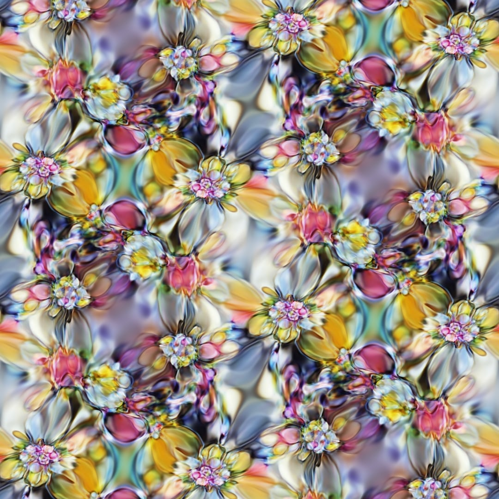

Some readers may be familiar with [this work](https://distill.pub/2018/differentiable-parameterizations/) on differentiable image parameterisations. It's really, very cool, producing incredible images like the following:


These images are not only pretty but offer some great insights into how neural networks work. In this post, I'll briefly outline how they work before illustrating some simple extensions that allow you to create arbitrary geometric patterns, tilings and moving images.

## What's a CPPN?

So CPPN is apparently a "Compositional Pattern Producing Network". Essentially, a CPPN is a function from 2D coordinates into a colour space. For example the function

```py
def silly_cppn(x: float, y: float, theta: float):
    # return 0-1 RGB
    redness = sigmoid(x * theta)
    return redness, 0, 0
```

is a CPPN. But it's not very expressive, and it doesn't do anything exciting.

In the original work, they note that you can have an arbitrary multi-layer perceptron as your CPPN, provided the input is 2D and the output is 3D. Further, suppose you have a CNN which takes 3D tensor input with two spatial dimensions and one colour dimension - you can apply your CPPN at every point in the spatial grid in order to get a 2D image of the appropriate size, and then feed this directly into the CNN. You can then select a neuron of interest in the CNN and maximise its activation by learning the parameters of the CPPN (because the whole scheme is differentiable).


This lets you learn CPPN parameters that produce images which excite the chosen neuron. By inspecting many neurons, you can find latent parts of the network that appear to detect eyes and flowers, as illustrated in the opening image.

## Enforcing Spatial Regularity

One of the cool things about this approach is that it's very flexible. The authors used an [0, 1] xy grid as their input, which seems natural enough, but we can alter that grid to enforce all sorts of spatial regularities. For example, suppose we want a grid tiling that aligns at the edges of the image. Because the CPPN is deterministic and applied pointwise, we know that if the input at two points in space is the same then the output will be the same. Enforcing a tiling can then be achieved by seeking a coordinate grid that tiles (is identical along the edges) with no other alterations to the scheme. Assuming the input `grid` is a 3D tensor of `height, width, xy` then we can compute a tiling grid with 

```python
import numpy as np

def get_grid(size):
  x = np.linspace(0, 1, num=size)
  return np.stack(np.meshgrid(x, x), axis=-1)

def tiling_grid(grid):
  grid = grid * np.pi * 2
  return np.concatenate([np.cos(grid), np.sin(grid)], axis=-1)

# Test that things actually tile by checking the edges
# of the grid are all equal
x = tiling_grid(get_grid(224))
assert np.all(np.isclose(x[-1], x[0]))
assert np.all(np.isclose(x[:, -1], x[:, 0]))
```

This new tiling grid can then be fed into the scheme for generating images to enforce the constraints. The results are pretty cool!


This form of tiling is pretty un-natural looking; however. I experimented with a few others. For example, hexagonal tilings can be accomplished by introducing three non-orthogonal spatial dimensions and tiling along those



Because of how general the original framework is, you can extend beyond tilings. Another approach I experimented with was adding a time axis and using it to introduce the radial-flow style effects that are famous from music visualisers. You can even use the same tiling approach that works in space to ensure that the clip loops perfectly in time. Some of these came out pretty well!

<video loop autoplay muted>
    <source src="flower-flow.webm" type="video/webm">
    Your browser does not support the video tag.
</video>

In summary - CPPNs are great for generating abstract images under pretty arbitrary geometric constraints. I'm excited to play with them more!